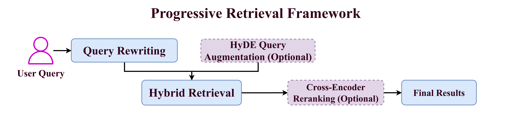
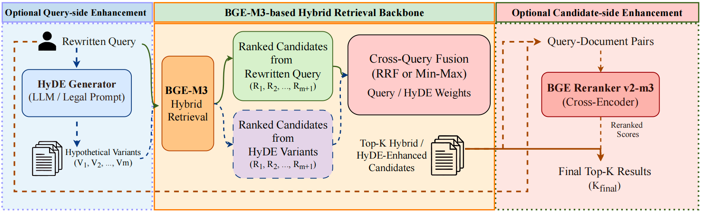

# LexRAG: Unified Progressive Retrieval Framework for Multi-turn Legal Consultation

<p align="center">
  <a href="./README_zh.md">📖 中文</a> | English
</p>

This repository contains the core implementation for the dissertation *Research on the Optimization of Retrieval Strategy for Multi-round Legal Consultation System Based on RAG*. It focuses on optimizing statute retrieval in Chinese multi-turn legal consultation scenarios.

This project is a secondary research implementation built on the LexRAG dataset and the LexiT framework proposed by the Tsinghua University team. The original LexRAG project provides Chinese multi-turn legal consultation data, a statutory corpus, query rewriting ideas, and a modular RAG pipeline. Based on that foundation, this repository focuses on **retrieval-side optimization** and builds a unified progressive retrieval framework around `BGE-M3`, comparing hybrid retrieval, HyDE query augmentation, and Cross-Encoder reranking for statute retrieval.

## 1. Project Origin and Modifications

This project does not build a new legal RAG benchmark from scratch. Instead, it extends and modifies the LexRAG / LexiT setting for retrieval optimization experiments. The original project can be found at `https://github.com/CSHaitao/LexRAG`.

This project reuses or follows these parts of the original work:

- The Chinese multi-turn legal consultation task setting from LexRAG.
- The multi-turn dialogue data, statutory corpus, and retrieval evaluation target from LexRAG.
- The modular LexiT pipeline design, including processor, retriever, generator, and evaluator components.
- Query rewriting as a shared preprocessing step for multi-turn contextual retrieval.

The main modifications and extensions in this repository are:

- The research focus is shifted from a complete RAG toolkit to statute retrieval strategy optimization.
- `BGE-M3` dense + sparse hybrid retrieval is added as the main retrieval backbone.
- HyDE-based query augmentation is added to reduce the expression gap between user questions and formal statutory language.
- A Cross-Encoder reranking path is added to evaluate candidate-side second-stage reranking.
- Hybrid retrieval, HyDE, and reranking are unified in `BGEM3ProgressiveRetriever` and can be enabled through component switches.
- `run_progressive_retrieval.py` is added as the main entry point for running the unified progressive retrieval framework.

Therefore, this repository should be understood as a retrieval optimization implementation based on LexRAG data and the LexiT framework, not as the official version of the original LexRAG / LexiT project.

## 2. Research Goal and Key Findings

The dissertation focuses on these problems:

- In multi-turn legal consultation, current-turn questions often depend on previous context and contain references, omissions, or missing constraints.
- User questions are usually expressed in natural language, while statutory texts use formal legal terminology and writing style.
- A single retrieval path struggles to balance semantic matching and legal term matching.

The implemented progressive retrieval framework addresses these problems as follows:

1. Query rewriting converts multi-turn dialogue context into standalone retrievable questions.
2. `BGE-M3` is used as a unified encoder for dense + sparse hybrid retrieval.
3. `HyDE` can optionally generate legal-style hypothetical texts before retrieval.
4. A `Cross-Encoder` can optionally rerank candidate statutes after retrieval.

According to the dissertation experiments:

- `Hybrid Retrieval` performs better than dense-only retrieval overall.
- `HyDE-Enhanced Hybrid Retrieval` achieves the best performance under the current experimental setting.
- `Cross-Encoder Reranking` does not bring improvement in the current dataset and parameter setting.

## 3. Framework Overview

The unified framework follows this workflow:

```text
Multi-turn dialogue
  -> Query Rewriting
  -> Optional HyDE augmentation
  -> BGE-M3 dense + sparse hybrid retrieval
  -> Optional Cross-Encoder reranking
  -> Top-K statute results
  -> Retrieval evaluation
```

This design corresponds to Chapter 3 of the dissertation. In code, these retrieval strategies are implemented as one unified orchestrator instead of several disconnected experiment scripts.

<p align="center">
  
  <br>
  <em>Progressive Retrieval Framework Used in This Study</em>
</p>

## 4. Dissertation-to-Code Mapping

| Dissertation module | Code location | Role |
| --- | --- | --- |
| Query Rewriting | `src/process/rewriter.py` | Converts multi-turn context into standalone retrievable questions |
| Unified retrieval framework | `src/retrieval/bge_m3_progressive_retrieval.py` | Defines progressive retrieval components, configuration, and experiment entry points |
| Retrieval entry script | `run_progressive_retrieval.py` | Runs different modes through component switches and parameters |
| Retrieval pipeline | `src/retrieval/run_retrieval.py` | Connects the progressive retriever to the existing pipeline |
| Retrieval evaluation | `src/eval/evaluator.py` | Computes Recall / Precision / F1 / NDCG / MRR |
| Default model configuration | `src/config/config.py` | Stores LLM configuration for HyDE and generation modules |

<p align="center">
  
  <br>
  <em>Query-side and Candidate-side Enhancement Paths over the BGE-M3-based Hybrid Retrieval Backbone</em>
</p>

### 4.1 What `bge_m3_progressive_retrieval.py` Implements

This is the central implementation file in the project:

- `BGEM3HybridRetriever`
  - Uses `BGE-M3` to produce both dense and sparse representations.
  - Uses `FAISS IndexFlatIP` for the dense branch.
  - Uses an inverted index with token weights for the sparse branch.
  - Supports both `rrf` and `minmax` fusion.

- `HyDEGenerator` / `HyDEAugmentationComponent`
  - Generates legal-style hypothetical texts from the original query.
  - Caches generated variants to avoid repeated LLM calls.
  - Fuses original-query and HyDE-query retrieval results through cross-query fusion.

- `RerankerComponent`
  - Uses `BAAI/bge-reranker-v2-m3` for second-stage candidate reranking.

- `BGEM3ProgressiveRetriever`
  - Unifies four retrieval modes:
    - Hybrid only
    - HyDE + Hybrid
    - Hybrid + Reranker
    - HyDE + Hybrid + Reranker

- `build_progressive_run_config()` / `run_progressive_experiment()`
  - Builds default configurations for each mode.
  - Runs retrieval and evaluation through the pipeline.

## 5. Data and Input Format

Core data files:

- `data/law_library.jsonl`
  - Statutory corpus.
- `data/dataset.json`
  - Multi-turn legal consultation data.
- `data/rewrite_question.jsonl`
  - Query-rewritten retrieval input.

If `data/rewrite_question.jsonl` already exists, you can directly run progressive retrieval. Otherwise, run query rewriting first.

## 6. Environment Setup

Recommended environment:

- Python `3.9` or `3.10`
- GPU versions of `faiss` and `torch` are recommended if a GPU is available.

Install dependencies:

```bash
pip install -r requirements.txt
```

For a CPU-only environment, replace `faiss-gpu` in `requirements.txt` with `faiss-cpu`.

### 6.1 HyDE Configuration

When `HyDE` is enabled, an available LLM configuration is required. By default:

- `LLM_CONFIG = None` in `run_progressive_retrieval.py`
- This falls back to `Config._default_configs["qwen"]` in `src/config/config.py`

To run HyDE, use one of these options:

1. Fill in the `api_key` field of the `qwen` configuration in `src/config/config.py`.
2. Define a custom `LLM_CONFIG` in `run_progressive_retrieval.py`.

## 7. Query Rewriting

If `data/rewrite_question.jsonl` has not been generated, run query rewriting first:

```python
from src.pipeline import ProcessorPipeline

pipeline = ProcessorPipeline(model_type="qwen")
pipeline.run_processor(
    process_type="rewrite_question",
    original_data_path="data/dataset.json",
    output_path="data/rewrite_question.jsonl",
    max_retries=5,
    max_parallel=32,
    batch_size=20
)
```

This shared preprocessing step handles context dependency and information omission in multi-turn dialogue.

## 8. Running the Unified Progressive Retrieval Framework

### 8.1 Direct Run

Main entry file:

- `run_progressive_retrieval.py`

Run:

```bash
python run_progressive_retrieval.py
```

The script performs two steps:

1. Runs retrieval through `run_progressive_experiment()`.
2. Runs retrieval evaluation through `EvaluatorPipeline`.

### 8.2 Component Switches

Edit the switches at the top of `run_progressive_retrieval.py`:

```python
ENABLE_HYDE = True
ENABLE_RERANKER = False
```

Available modes:

| `ENABLE_HYDE` | `ENABLE_RERANKER` | Mode | Output file |
| --- | --- | --- | --- |
| `False` | `False` | Hybrid Retrieval | `data/retrieval/res/retrieval_bge-m3_hybrid.jsonl` |
| `True` | `False` | HyDE + Hybrid Retrieval | `data/retrieval/res/retrieval_bge-m3_hybrid_hyde.jsonl` |
| `False` | `True` | Hybrid + Reranker | `data/retrieval/res/retrieval_bge-m3_hybrid_rerank.jsonl` |
| `True` | `True` | HyDE + Hybrid + Reranker | `data/retrieval/res/retrieval_bge-m3_hybrid_hyde_rerank.jsonl` |

### 8.3 Current Default Mode

The current default setting in `run_progressive_retrieval.py` is:

```python
ENABLE_HYDE = True
ENABLE_RERANKER = False
```

This runs the best-performing mode in the dissertation: **HyDE-Enhanced Hybrid Retrieval**.

### 8.4 Key Parameters

| Parameter | Meaning |
| --- | --- |
| `TOP_K` | Number of final retrieved statutes |
| `DENSE_TOP_K` | Candidate depth of the dense branch |
| `SPARSE_TOP_K` | Candidate depth of the sparse branch |
| `DENSE_WEIGHT` / `SPARSE_WEIGHT` | Fusion weights for dense and sparse retrieval |
| `FUSION` | Internal fusion method, either `rrf` or `minmax` |
| `HYDE_NUM_VARIANTS` | Number of generated HyDE variants |
| `QUERY_WEIGHT` / `HYDE_WEIGHT` | Cross-query fusion weights for the original query and HyDE queries |
| `CROSS_FUSION` | Fusion method across the original query and HyDE variants |
| `RERANK_TOP_K` | Number of candidates sent to the reranker |
| `RERANK_QUERY_SOURCE` | Whether reranking uses the original query or the first HyDE variant |

### 8.5 Dissertation-Aligned Defaults

`build_progressive_run_config()` in `src/retrieval/bge_m3_progressive_retrieval.py` encodes the dissertation-aligned default settings.

Hybrid mode defaults:

- `dense_weight=0.8`
- `sparse_weight=0.2`
- `fusion="minmax"`

HyDE mode defaults:

- `hyde_num_variants=2`
- `query_weight=1.0`
- `hyde_weight=0.75`
- `cross_fusion="minmax"`

To reproduce the main retrieval experiments, change only the component switches and run `run_progressive_retrieval.py`.

## 9. Outputs

### 9.1 Retrieval Results

Retrieval results are written to:

- `data/retrieval/res/`

Each question receives retrieved statutes under:

- `question.recall`

### 9.2 Indexes and Caches

Runtime artifacts include:

- `data/retrieval/bge_m3*/`
  - dense FAISS index, sparse inverted index, and metadata
- `data/retrieval/hyde_cache/`
  - cached HyDE generations

### 9.3 Evaluation Report

The retrieval evaluation report is appended to:

- `data/retrieval/report.jsonl`

Default metrics:

- `recall`
- `precision`
- `f1`
- `ndcg`
- `mrr`

Default `k` values:

- `[1, 3, 5, 10]`

## 10. Experimental Results

The following table summarizes the five retrieval settings compared in the dissertation.

**Comparison of Five Retrieval Strategies**

| Strategy | Recall@1 | Recall@3 | Recall@5 | Recall@10 | NDCG@1 | NDCG@3 | NDCG@5 | NDCG@10 |
| --- | ---: | ---: | ---: | ---: | ---: | ---: | ---: | ---: |
| Dense Retrieval (Baseline) | 0.1451 | 0.2493 | 0.3011 | 0.3757 | 0.1576 | 0.2174 | 0.2398 | 0.2651 |
| Hybrid Retrieval | 0.1480 | 0.2593 | 0.3088 | 0.3855 | 0.1607 | 0.2246 | 0.2459 | 0.2718 |
| Hybrid Retrieval + Cross-Encoder | 0.1438 | 0.2557 | 0.3071 | 0.3824 | 0.1561 | 0.2209 | 0.2428 | 0.2684 |
| HyDE-Enhanced Hybrid Retrieval | **0.1917** | **0.3161** | **0.3812** | **0.4701** | **0.2081** | **0.2777** | **0.3054** | **0.3349** |
| HyDE-Enhanced Hybrid Retrieval + Cross-Encoder | 0.1435 | 0.2570 | 0.3110 | 0.3868 | 0.1557 | 0.2215 | 0.2444 | 0.2701 |

Under the current setting, the most important modes to reproduce are:

- Query Rewriting + Hybrid Retrieval
- Query Rewriting + HyDE + Hybrid Retrieval

## 11. Citation

```bibtex
@thesis{huang2026progressivelegalretrieval,
  title={Research on the Optimization of Retrieval Strategy for Multi-round Legal Consultation System Based on RAG},
  author={Huang, Qikang},
  year={2026},
  school={Communication University of China, Hainan International College}
}
```
